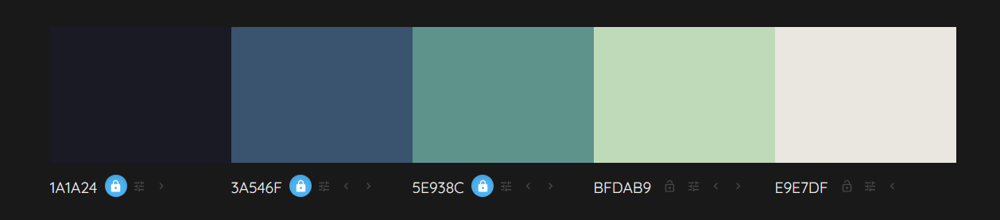
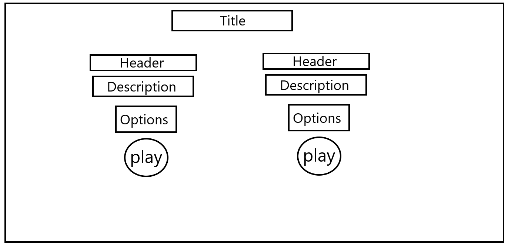
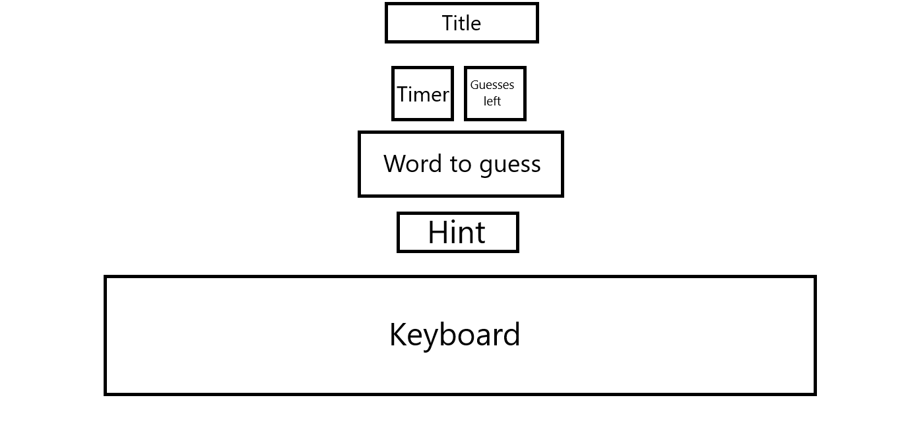

# Hang Man
A hangman word game website, built with multiple ways to play, Single Words or Phrases, Timed or Untimed, and a selection of themed wordsets to choose from, all packaged together with a simple and easy on the eyes UI.  

## User Stories
- As a user I want to be able to choose to play with a timer or without one
- As a user I want to be able to pick from a selection of word sets
- As a user I want to be able to use my keyboard to play
- As a user I want to be able to play from a mobile device
- As a user if i fail to guess within 11 guesses or 120seconds i want to be shown the answer

## UX
For the design I chose to have a very simple site using a dark single color background so that other elements can use brighter colors and stand out, making visibility easier. On the page for actually playing the game, each section will be grouped by a violet border, e.g. keyboard for you guesses and the hint will be in two different boxes. The timer will be in a larger font with a larger innerbox to make it stand out more to the user. For the coloring of the keyboard, an unused Letter will be in blue, as this is the starting color for all of them the user will instantly understand that means its an unused letter, once selected the letter will change to either red or green depending on if the guess was correct or not, and in the box that holds the word to be guessed, if the selected letter is correct, the corresponding box will be changed to green and hold that letter.

### Color Scheme
I used [colorminds](http://colormind.io/) to find create a color pallete for my site.

I plan to only use two colors from this, one for the background and another for button hover overs, as on the game page borders will be used heavily and they will be colored using mainly primary colors, so a simple colored background will help them stand out and with visibility.

*Scheme Used*

### Typography
To select my fonts I used [Font Joy](https://fontjoy.com/)

I dedcided to use a simple, thin, undecrotive font. I chose Fira Sans and used the site above to find a second font to pair with it. I used Fira Sans as the Header font as it stands out, because of that I also used it in the game page for all of the letters used, I thought it would be distracting to have multiple fonts on the screen due to the many differnet buttons and sections, and having a font that stands out would help with this. 

*Fonts Used*
### Wireframes

*Index Wireframe*

*Play Wireframe*
## Features
### Existing Features
- How To Play
    - Link in nav bar that brings up a modal to teach you how to play the game

- Game Options
    - Dropdown that auto fills word sets for the user to pick from
    - Radio button too select if you want have a timer or not
    - Allows the user to change how they want to play

- Play 
    - Depending on options selected will either have a timer box and guesses left box, or just a guesses left box
    - A box containing the word to be guessed with the correct amount of squares
    - A box containing a hint
    - A keyboard for guessing letters
    - A hidden "Play Again" button that replaces the guesses left/timer box once the game is over

*Timed phrase incomplete*

*Timed phrase complete*

*Phrase Fail*

*Untimed word incomplete*

*Word complete*

*Play Again*

### Features Left to Implement
Read from the Non-sentence and sentence folders and fill the selects on index with them.

Have a random mode which uses an api like https://dictionaryapi.dev/ to get random words

## Technologies Used
- I used [git](https://git-scm.com/) for version control and storage.
- To help with using git, I used [github](https://github.com/).

- I used [html](https://en.wikipedia.org/wiki/HTML) to design the site.
- And [CSS](https://en.wikipedia.org/wiki/CSS) to style the site.
- For the games functionality, I used [Javascript](https://en.wikipedia.org/wiki/JavaScript)
- To help with styling I used a css debugger to help me with things like positioning and size: [link](https://github.com/benscabbia/x-ray).
- For my IDE I used Gitpod, [link](https://www.gitpod.io/).
- I used githubs [projects](https://github.com/edenobrega/multimode-hangman-5p/projects/1) tab to track what i needed to do and what problems i came across 

## Testing

To see all testing see [TESTING.md](documentation/TESTING.md)

## Deployment
The site was deployed to GitHub pages. The steps to deploy are as follows:

    In the GitHub repository, navigate to the Settings tab.
    From the Settings tab, scroll down until you see the 'Pages' button on the left.
    From the Source section drop-down menu, select the Main branch.
    Once the Main branch has been selected, the page will be automatically refreshed with a detailed ribbon display to indicate the successful deployment.

The live link can be found here - https://edenobrega.github.io/multimode-hangman-5p/

## Local Deployment
To make a local copy of this project, you can clone it by typing the following in your IDE terminal:

- `git clone https://github.com/edenobrega/multimode-hangman-5p.git`

Alternatively, if using Gitpod, you can click below to create your own workspace using this repository.

## Credits

### Content
https://www.ef.com/wwen/blog/language/20-english-idioms-that-everyone-should-know/
https://datahub.io/core/country-list#data-cli
### Media
