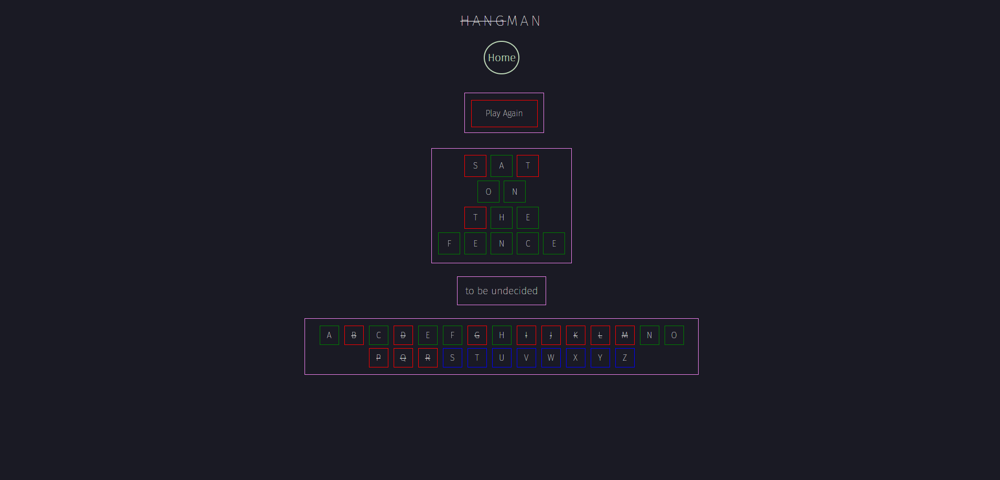
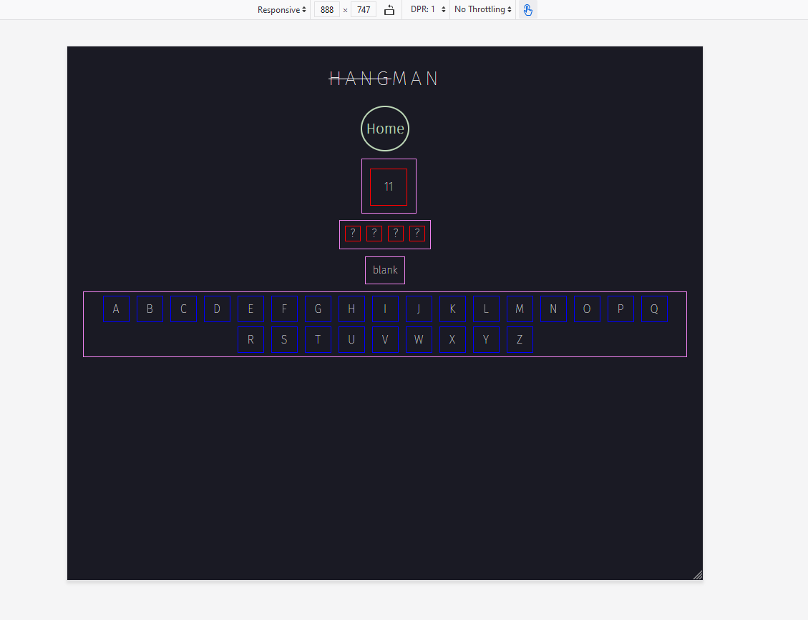

## User Stories
I tested my user stories
- As a user I want to be able to choose to play with a timer or without one

- As a user I want to be able to pick from a selection of word sets

- As a user I want to be able to use my keyboard to play
- As a user I want to be able to play from a mobile device

- As a user if i fail to guess within 11 guesses or 120seconds i want to be shown the answer

### Browser Compatibility

*Home page (left) shown in chrome, and play page (right) shown in firefox*

*Play page shown in chrome (left) and edge (right)*

### Responsiveness

*index.html shown on my phone, huawei mate 20 pro*

*play.html shown on my phone, huawei mate 20 pro*

*index.html shown at 880px*

*index.html shown at 1280px*

### Unfixed Bugs

### Code Validation
For validation I used two tools from w3, for html I used [Nu Html Checker](https://validator.w3.org/nu/), for css I used [CSS Validation Service](https://jigsaw.w3.org/css-validator/) and for jscript I used [jshint](https://jshint.com/)

JSHint validation for index.js, showing no errors

JSHint validation for script.js, showing no errors, but two errors, the first is about variables and confusing semantics, but the variable in question is used only once and is directly above the loop, and the undefined variable is a [interface](https://developer.mozilla.org/en-US/docs/Web/API/URLSearchParams) that helps working with url params

CSS Validation for style.css showing no errors

CSS Validation for index.css showing no errors

CSS Validation for play.css showing no errors

HTML Validation for index.html showing no errors

HTML Validation for play.html showing no errors
